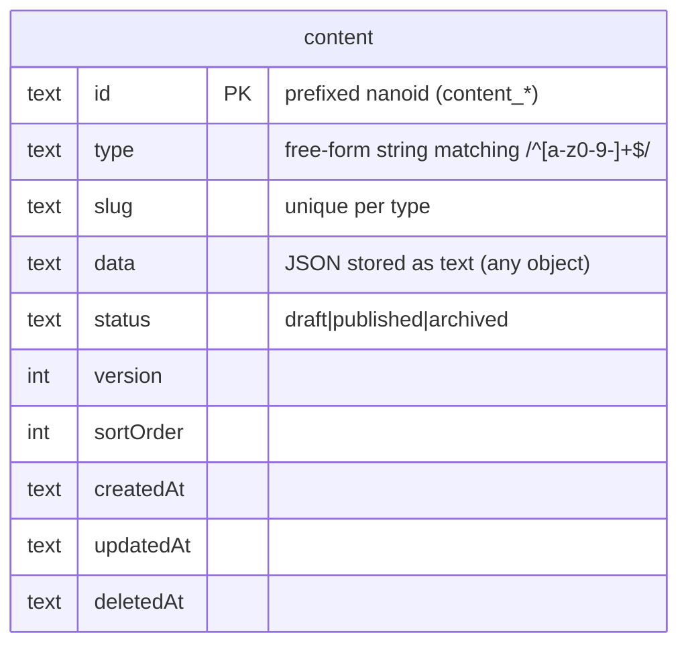

# Content Model Reference

This document defines content storage, the `data` column format, and how custom content types work in the Portfolio CMS.

## Overview

All content is stored in a single `content` table with a flexible JSON `data` column. Content is categorized by `type` and identified by `slug`. The `type` field is a free-form string -- you can use any lowercase alphanumeric value with hyphens (matching `/^[a-z0-9-]+$/`, max 100 characters).



::: info
The unique constraint is on `(type, slug)` together -- the same slug can exist under different content types.
:::

**Example data:**

| type | slug | data | status |
|------|------|------|--------|
| project | folionaut | `{title, description, tags...}` | published |
| experience | work-history | `{items: [{company, role, startDate...}]}` | published |
| blog-post | hello-world | `{title, body, publishedDate...}` | published |
| certification | aws-saa | `{name, issuer, dateEarned...}` | published |
| about | about | `{title, content...}` | published |
| contact | contact | `{name, email, social...}` | published |

::: tip
The `type` field is not an enum -- you can create any type string you need. Use the `list_types` tool or `GET /api/v1/content` to discover which types currently exist in the database.
:::

## Base Schema

All content items share these fields:

| Field | Type | Required | Description |
|-------|------|----------|-------------|
| `id` | UUID | Auto | Unique identifier |
| `type` | string | Yes | Free-form string matching `/^[a-z0-9-]+$/` (max 100 chars) |
| `slug` | string | Yes | URL-friendly identifier (unique per type) |
| `data` | JSON | Yes | Any JSON object (structure is up to you) |
| `status` | enum | Yes | `draft`, `published`, or `archived` |
| `version` | integer | Auto | Increments on each update |
| `sortOrder` | integer | No | Display order (default: 0) |
| `createdAt` | timestamp | Auto | Creation time |
| `updatedAt` | timestamp | Auto | Last update time |
| `deletedAt` | timestamp | Auto | Soft delete time (null if active) |

### Type Rules

- Lowercase alphanumeric with hyphens only: `^[a-z0-9-]+$`
- Maximum 100 characters
- Not an enum -- any conforming string is valid

### Slug Rules

- Lowercase alphanumeric with hyphens only: `^[a-z0-9-]+$`
- Maximum 100 characters
- Unique within a `type`

## The `data` Column

The `data` column stores any valid JSON object. There are no per-type schemas enforced by the application -- the structure is entirely up to you. This means you can store whatever fields make sense for your content type without needing to update validation code or run migrations.

::: info
The previous per-type Zod schemas (`ProjectDataSchema`, `ExperienceDataSchema`, etc.) and the `validateContentData()` function have been removed. The `data` field now accepts any JSON object.
:::

### Conventional Examples

While any JSON object is valid, here are some conventional structures that work well for common content types:

#### Project

```json
{
  "type": "project",
  "slug": "folionaut",
  "status": "published",
  "sortOrder": 1,
  "data": {
    "title": "Folionaut",
    "description": "A TypeScript/Express backend with CMS, AI chat, and MCP integration.",
    "content": "## Overview\n\nThis project demonstrates...",
    "tags": ["typescript", "express", "sqlite", "ai"],
    "links": {
      "github": "https://github.com/user/folionaut",
      "live": "https://api.myportfolio.com"
    },
    "coverImage": "https://images.myportfolio.com/folionaut.png",
    "featured": true
  }
}
```

#### Experience (list-based)

```json
{
  "type": "experience",
  "slug": "work-history",
  "status": "published",
  "data": {
    "items": [
      {
        "company": "Tech Corp",
        "role": "Senior Software Engineer",
        "description": "Led development of microservices platform...",
        "startDate": "2022-06",
        "endDate": null,
        "location": "San Francisco, CA",
        "type": "full-time",
        "skills": ["TypeScript", "Kubernetes", "PostgreSQL"]
      }
    ]
  }
}
```

#### About

```json
{
  "type": "about",
  "slug": "about",
  "status": "published",
  "data": {
    "title": "About Me",
    "content": "# Hello!\n\nI'm a software engineer based in...",
    "image": "https://images.myportfolio.com/headshot.jpg"
  }
}
```

## Custom Content Types

Since `type` is a free-form string, you can create any content type you need without code changes. Simply use a new type string when creating content via the admin API or MCP tools.

### Examples of Custom Types

```bash
# Blog posts
curl -X POST /api/v1/admin/content \
  -H "X-Admin-Key: ..." \
  -d '{
    "type": "blog-post",
    "slug": "hello-world",
    "data": { "title": "Hello World", "body": "My first post...", "publishedDate": "2025-06-01" },
    "status": "published"
  }'

# Certifications
curl -X POST /api/v1/admin/content \
  -H "X-Admin-Key: ..." \
  -d '{
    "type": "certification",
    "slug": "aws-solutions-architect",
    "data": { "name": "AWS Solutions Architect", "issuer": "Amazon", "dateEarned": "2024-03", "credentialUrl": "https://..." },
    "status": "published"
  }'

# Testimonials
curl -X POST /api/v1/admin/content \
  -H "X-Admin-Key: ..." \
  -d '{
    "type": "testimonial",
    "slug": "from-jane",
    "data": { "author": "Jane Doe", "role": "Engineering Manager", "quote": "Excellent engineer..." },
    "status": "published"
  }'
```

### Discovering Types

Use the `list_types` tool (available in both chat and MCP) to discover which content types currently exist in the database. This returns all distinct type strings that have been used.

## Content Bundle

The `/api/v1/content/bundle` endpoint returns all published content organized for frontend consumption. The bundle is a dynamic record keyed by content type -- every type present in the database gets its own array:

```typescript
type ContentBundle = Record<string, ContentWithData[]>

// Example shape (depends on what types exist in your database):
// {
//   "project": [...],
//   "experience": [...],
//   "education": [...],
//   "skill": [...],
//   "about": [...],
//   "contact": [...],
//   "blog-post": [...],
//   "certification": [...]
// }
```

::: info
All values in the bundle are arrays. There are no singleton types -- even types like `about` or `contact` that typically have a single item are returned as single-element arrays. The keys in the bundle correspond exactly to the raw `type` strings stored in the database.
:::

## Versioning

Every content update creates a history record:

| Field | Description |
|-------|-------------|
| `contentId` | Reference to content item |
| `version` | Version number at time of snapshot |
| `data` | Complete data JSON at that version |
| `changeType` | `created`, `updated`, `deleted`, `restored` |
| `changedBy` | Identifier of who made the change |
| `changeSummary` | Auto-generated description of changes |
| `createdAt` | When this version was created |

### Version Operations

**Get history:**
```
GET /api/v1/admin/content/:id/history
```

**Restore version:**
```
POST /api/v1/admin/content/:id/restore
Body: { "version": 3 }
```

## Best Practices

### Content Organization

1. **Use meaningful slugs**: `folionaut` not `project-1`
2. **Set sortOrder**: Control display order explicitly
3. **Keep descriptions concise**: Full content goes in `content` field
4. **Tag consistently**: Use lowercase, hyphenated tags

### Markdown Content

- Use standard Markdown (CommonMark)
- Images should be absolute URLs
- Code blocks with language hints: ` ```typescript `
- Keep headings hierarchical (don't skip levels)
