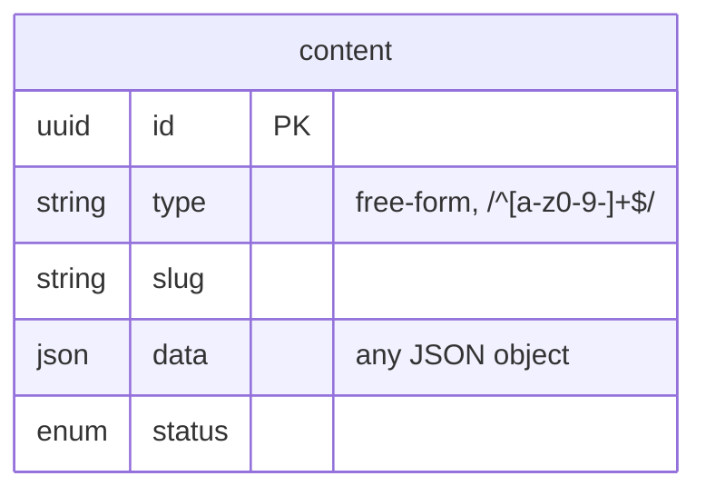

# ADR 007: Content Model Flexibility

## Status

<Badge type="tip" text="Accepted" /> -- Updated to reflect removal of per-type validation

## Context

The portfolio CMS needs to store diverse content types. The original design used:
- A 6-value enum for the `type` column (`project`, `experience`, `education`, `skill`, `about`, `contact`)
- Per-type Zod schemas (`ProjectDataSchema`, `ExperienceDataSchema`, etc.) to validate the `data` column on write
- A `validateContentData()` function that dispatched to the correct schema based on type

This worked but created friction:
- Adding a new content type required updating the enum, creating a new Zod schema, and updating the validation dispatch
- The fixed enum prevented users from creating custom types like `blog-post`, `certification`, or `testimonial` without code changes
- Per-type schemas were often overly prescriptive for a system where the frontend is the primary consumer and can handle any JSON shape

Design tension:
- **Schema rigidity**: Strong typing prevents errors, enables validation
- **Schema flexibility**: Easier to evolve, add new content types, customize

A portfolio is personal -- different users want different structures. The content model must prioritize flexibility.

## Decision

Use a **fully flexible approach**:
1. Fixed schema for metadata columns (`id`, `type`, `slug`, `status`, `version`)
2. `type` is a **free-form string** matching `/^[a-z0-9-]+$/` (max 100 chars), not an enum
3. `data` is **any JSON object** -- no per-type schema validation
4. No database-level JSON schema enforcement
5. A `list_types` tool is provided for runtime type discovery

The per-type Zod schemas (`ProjectDataSchema`, `PageDataSchema`, `ExperienceDataSchema`, `SkillDataSchema`, `AboutDataSchema`, `ContactDataSchema`) and the `validateContentData()` function have been removed.

| id | type | slug | data | status |
|----|------|------|------|--------|
| uuid-1 | project | app-x | `{title:...}` | published |
| uuid-2 | blog-post | hello | `{title:..., body:...}` | published |
| uuid-3 | certification | aws-saa | `{name:..., issuer:...}` | draft |
| uuid-4 | contact | contact | `{name:..., email:...}` | published |

## Alternatives Considered

| Approach | Pros | Cons |
|----------|------|------|
| **Separate tables per type** | Strong typing, referential integrity | Schema changes require migrations, rigid |
| **EAV (Entity-Attribute-Value)** | Maximum flexibility | Query nightmare, no type safety |
| **JSON column (unvalidated, free-form types)** | Maximum flexibility, no code changes for new types | No validation, inconsistent data possible |
| **JSON column (app-validated, enum types)** | Flexibility + validation at API boundary | Enum limits extensibility, validation code overhead |
| **Document database** | Native JSON, flexible schemas | Different tech stack, overkill |

## Rationale

### Why Remove Per-Type Validation?

The per-type Zod schemas added maintenance burden without proportional benefit:
- The frontend is the primary consumer and already needs to handle varying shapes
- Admin users (the only writers) are trusted and know what structure they want
- Adding a new content type should not require a code change and redeployment
- The `data` column was already stored as opaque JSON text in SQLite -- the DB never enforced structure

### Why Free-Form Types?

A fixed 6-value enum forced every new content type to go through a code change cycle. With free-form types:
- Users can create `blog-post`, `certification`, `testimonial`, `talk`, `publication`, or any other type instantly
- The `list_types` tool provides runtime discovery of existing types
- The `ContentBundle` becomes `Record<string, ContentWithData[]>`, naturally accommodating any set of types
- MCP resource templates use dynamic discovery instead of hardcoded per-type resources

### What Validation Remains?

- **Metadata validation**: `type` must match `/^[a-z0-9-]+$/` (max 100 chars), `slug` must match the same pattern, `status` must be one of `draft`/`published`/`archived`
- **Structural validation**: `data` must be a valid JSON object (not null, not an array, not a primitive)
- **Uniqueness**: The `(type, slug)` pair must be unique

## Consequences

### Positive

- **Maximum flexibility**: Add new content types without any code changes
- **Simpler codebase**: No per-type schema files, no validation dispatch function
- **Dynamic discovery**: `list_types` tool and dynamic MCP resources adapt automatically
- **Simple queries**: Single table for all content
- **Version friendly**: JSON changes don't require schema versioning
- **Lower maintenance**: No schemas to keep in sync when data shapes evolve

### Negative

- **No write-time data validation**: Invalid JSON structures can be stored (e.g., missing fields the frontend expects)
- **No DB-level integrity**: Invalid JSON could be inserted directly to DB
- **Query limitations**: Can't index JSON fields efficiently (SQLite/libSQL)
- **No foreign keys in data**: References between content items are strings
- **Frontend responsibility**: The frontend must handle missing or unexpected fields gracefully

### Mitigations

- **Admin-only writes**: Only authenticated admin users can create/update content
- **Read-time coercion**: Parse dates, numbers on read
- **Application-level joins**: Fetch related content in service layer
- **Indexing metadata**: Index `type`, `slug`, `status` columns (not JSON)
- **Optional client-side validation**: Frontend apps can implement their own Zod schemas if they want type-safe access to the `data` field

## Future Considerations

If we need:
- **Full-text search**: Add search index (MeiliSearch, Algolia)
- **Complex queries on data**: Consider extracting to indexed columns
- **Optional server-side schemas**: Could add an opt-in schema registry where types can optionally declare a Zod schema
- **Multi-tenant**: Add tenant_id column, keep JSON structure

## Migration

The move to free-form types changed the bundle API response shape. If you are upgrading from the enum-based content model, note the following breaking changes:

- **Bundle keys changed from plural to singular**: `projects` -> `project`, `experiences` -> `experience`, `skills` -> `skill`, etc.
- **Singleton types changed from `T | null` to `T[]`**: `about` and `contact` were previously `ContentItem | null`; they are now arrays like every other type.
- **Empty bundle changed from pre-populated object to `{}`**: The old bundle returned `{ projects: [], experiences: [], ..., about: null, contact: null }` even when no content existed. The new bundle returns only keys for types that have content.
- **Recommended access pattern**: Use `bundle['type'] ?? []` to safely access any type, e.g., `bundle['project'] ?? []`. This handles both missing keys and the array return type.

## References

- [PostgreSQL JSON Best Practices](https://www.postgresql.org/docs/current/datatype-json.html) (concepts apply to SQLite JSON1)
- [Zod Documentation](https://zod.dev/)
- [Headless CMS Data Modeling](https://www.contentful.com/help/content-modelling-basics/)
